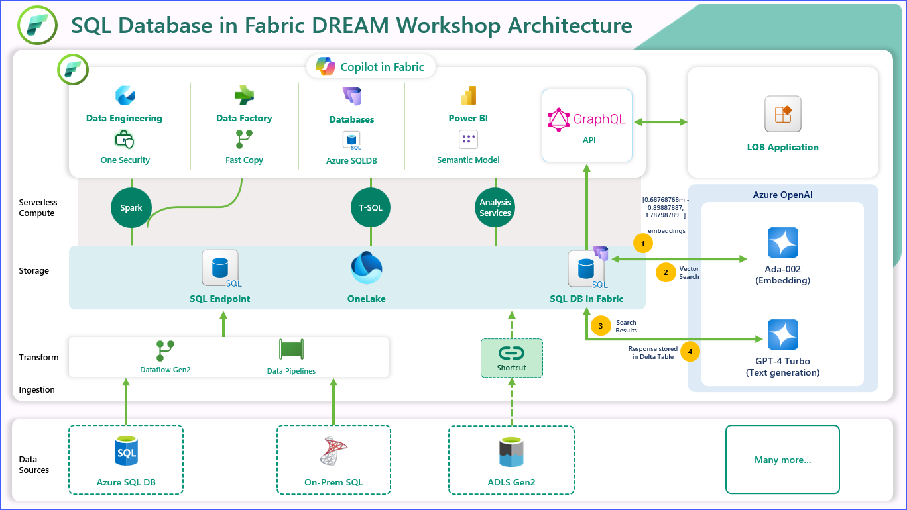
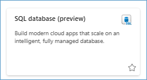
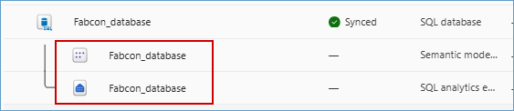

## SQL database in Microsoft Fabric DREAM workshop

>**Note:** Before we start the workshop, please ensure that you use only the **Workshop_Exercises** folder and avoid navigating to other folders, which are used for developing the workshop and only for the Dev team. Hyperlinks have been added for navigation—use them to access the exercises.

Welcome to the *SQL database in Microsoft Fabric* workshop. This workshop is designed to provide you with a comprehensive understanding of SQL database in Microsoft Fabric and its integration with other services. Throughout this workshop, you will learn how to create, manage, and optimize SQL databases, as well as how to leverage artificial intelligence and build applications using GraphQL API builder.



## Introduction to SQL Database in Fabric

### Understanding SQL Database in Fabric

**SQL database** in Microsoft Fabric is a developer-friendly transactional database, based on Azure **SQL Database**, that allows you to easily create your operational database in Fabric. A SQL database in Fabric uses the same SQL Database Engine as Azure SQL Database.

SQL database in Fabric is:

- The home in Fabric for OLTP workloads
- Easy to configure and manage
- Set up for analytics by automatically replicating the data into OneLake in near real time
- Integrated with development frameworks and analytics
- Based on the underlying technology of **Mirroring in Fabric**
- Queried in all the same ways as **Azure SQL Database**, plus a **web-based editor in the Fabric portal**

### Key Benefits of Using SQL Database in Fabric
SQL database in Fabric is a developer-friendly transactional database based on the Azure SQL database engine. It is simple, autonomous, secure by default and AI integrated. SQL database coming inside fabric means it benefits from fabric promises as well as tight integration into other workloads with in fabric. 



With your SQL database in Fabric, it makes it easy to not only build oltp applications but also reduces the need to stich together services to create an end to end solution. 

When you provision a SQL database, the data is stored in MDF and LDF formats. The data is then automatically replicated into OneLake and converted to Parquet, in an analytics-ready format. This enables downstream scenarios like data engineering, data science, and more. As a result, two child artifacts are provisioned along with your SQL database:

- A SQL analytics endpoint, which points to the OneLake, read-only copy of your data. 

- A default semantic model




#### Sharing
 
Sharing enables ease of access control and management, while security controls like row level security (RLS), object level security (OLS) and more make sure you can control access to sensitive information. Sharing also enables secure and democratized decision-making across your organization.
 
By sharing your SQL database, you can grant other users or a group of users, access to a database without giving access to the workspace and the rest of its items. When someone shares a database, they also grant access to the SQL analytics endpoint and associated default semantic model.
 
#### Connect
 
Like other Microsoft Fabric item types, SQL databases rely on Microsoft Entra authentication.
To successfully authenticate to a SQL database, a Microsoft Entra user, a service principal, or their group, must have the Read item permission for the database in Fabric.
 


In addition to the Fabric SQL database Query Editor, you can also connect your Fabric SQL database to your preferred client tools, including SQL Server Management Studio and mssql extension with Visual Studio Code. 
 
#### Cross-database queries
 
With the data from your SQL database automatically stored in OneLake, you can write cross-database queries, joining data from other SQL databases, mirrored databases, warehouses, and the SQL analytics endpoint in a single T-SQL query. All this is currently possible with queries on the SQL analytics endpoint of the SQL database, or lakehouse.
 
For example, you can reference a table from other items in Fabric using three-part naming. In the following example, use the three-part name to refer to ``ContosoSalesTable`` in the warehouse ``ContosoWarehouse`` from the fictional ``SalesLT.Affiliation`` table in a SQL database. From other databases or warehouses, the first part of the standard SQL three-part naming convention is the name of the database or warehouse item.
 
```
SELECT *
FROM ContosoWarehouse.dbo.ContosoSalesTable AS Contoso
INNER JOIN AdventureWorksLT.SalesLT.Affiliation AS Affiliation
ON Affiliation.AffiliationId = Contoso.RecordTypeID;
```
 
 
#### Data Engineering with your SQL database in Fabric
 
Microsoft Fabric provides various data engineering capabilities to ensure that your data is easily accessible, well-organized, and high-quality. From Fabric Data Engineering, you can:
 
- Create and manage your data as Spark using a SQL database in Fabric.
- Design pipelines to copy data into your SQL database in Fabric.
- Use Spark job definitions to submit batch/streaming jobs to Spark cluster.
- Use notebooks to write code for data preparation and transformation.
 
#### Data Science with your SQL database in Fabric
 
Data Science in Microsoft Fabric empowers users to complete end-to-end data science workflows for the purpose of data enrichment and business insights. You can complete a wide range of activities across the entire data science process, all the way from data exploration, preparation and cleansing to experimentation, modeling, model scoring and serving of predictive insights to BI reports.
 
#### Database portability and deployments with SqlPackage
 
SqlPackage is a cross-platform command line tool that enables database interactions that move entire databases or database objects. The portability (import/export) of a database managed in Azure or in Fabric ensures that your data is portable should you want to migrate later on. The same portability also enables certain migration scenarios through self-contained database copies (.bacpac) with import/export operations.
 
SqlPackage can enable easy database deployments of incremental changes to database objects (new columns in tables, alterations to existing stored procedures, etc.). SqlPackage can extract a .dacpac file containing the definitions of objects in a database, and publish a .dacpac file to apply that object state to a new or existing database. The publish operation also integrates with SQL projects, which enables offline and more dynamic development cycles for SQL databases.
 
#### Integration with Fabric source control
SQL database is integrated with [Fabric continuous integration/continuous development](https://learn.microsoft.com/en-us/fabric/cicd/cicd-overview). You can use the built-in git repository to manage your SQL database.
 
#### Create GraphQL API from Fabric portal
 
You can use the Fabric portal to easily [create a GraphQL API](https://learn.microsoft.com/en-us/fabric/database/sql/graphql-api) to mutate and query the data from your SQL database for your application.
 
#### Capacity management
 
You can use the [Microsoft Fabric Capacity Metrics app](https://learn.microsoft.com/en-us/fabric/enterprise/metrics-app) to monitor the SQL database usage and consumption in non-trial Fabric capacities.
 
#### Mirroring for Azure SQL Database
 
Do you already have an external database and want to leverage Fabric's integration? You can use Mirroring in Fabric as a low-cost and low-latency solution to bring data from various systems together. You can continuously replicate your existing data estate directly into Fabric's OneLake, including data from an existing Azure SQL Database.


Before we begin the execution of this workshop, please make sure to use the credentials provided to you to login to Fabric and Azure when prompted.

You will be executing the following modules as part of this workshop:


### 1. [Exercise 1: Loading Data into SQL Database](https://github.com/dreamdemos-ms/Fabcon_Workshop/blob/main/Workshop_Exercises/01%20-%20Loading%20Data%20into%20SQL%20Database.md)

This module covers the basics of getting started with SQL database in Fabric. You will learn how to create workspaces, create a database, and seed the database with initial data that will be used in later modules.

### 2. [Exercise 2: Introduction to Copilot for SQL Database](https://github.com/dreamdemos-ms/Fabcon_Workshop/blob/main/Workshop_Exercises/02%20-%20Introduction%20to%20Copilot%20for%20SQL%20Database.md)

In this exercise, we will leverage Copilot to assist with T-SQL queries, including auto-suggestions, fixing error, and natural language query.

### 3. [Exercise 3: Data Enrichment and Transformation](https://github.com/dreamdemos-ms/Fabcon_Workshop/blob/main/Workshop_Exercises/03%20-%20Data%20Enrichment.md)

This exercise focuses on data enrichment using Dataflow Gen2 and Notebooks. The transformed data will then be stored in SQL database in Fabric.

### 4. [Exercise 4: Data Serving](https://github.com/dreamdemos-ms/Fabcon_Workshop/blob/main/Workshop_Exercises/04%20-%20Data%20Serving.md)

In this exercise we will create a semantic model from the landed earlier in SQL database in fabric and use Copilot to gain insights and generate a report, enhancing data-driven decision-making.

### 5. [Exercise 5: Exploring GraphQL API Endpoints in Microsoft Fabric](https://github.com/dreamdemos-ms/Fabcon_Workshop/blob/main/Workshop_Exercises/05%20-%20Exploring%20GraphQL%20API%20Endpoints%20in%20Microsoft%20Fabric.md)

In this exercise, we will build a GraphQL API in Fabric and integrate its endpoint into an application.

### 6. [Exercise 6: RAG Implementation with Azure OpenAI](https://github.com/dreamdemos-ms/Fabcon_Workshop/blob/main/Workshop_Exercises/06-%20RAG%20Implementation%20with%20Azure%20OpenAI.md)

In this exercise, we will implement a Retrieval-Augmented Generation (RAG) system in Microsoft Fabric by utilizing a Fabric SQL database as the vector store, Azure OpenAI for text embeddings, and the GPT-4 model to enhance natural language queries and responses.

### 7. [Exercise 7: Data Security and Compliance](https://github.com/dreamdemos-ms/Fabcon_Workshop/blob/main/Workshop_Exercises/07%20-%20Data%20Security%20and%20Compliance.md)

In this exercise, we will explore workspace roles and SQL native access controls to effectively manage user permissions.

### 8. [Exercise 8: Managing Production Workloads](https://github.com/dreamdemos-ms/Fabcon_Workshop/blob/main/Workshop_Exercises/08%20-%20Managing%20Production%20Workloads.md)

In this exercise, we will explore different SQL database performance metrics available in Fabric and enable version control to track database changes efficiently.


 
