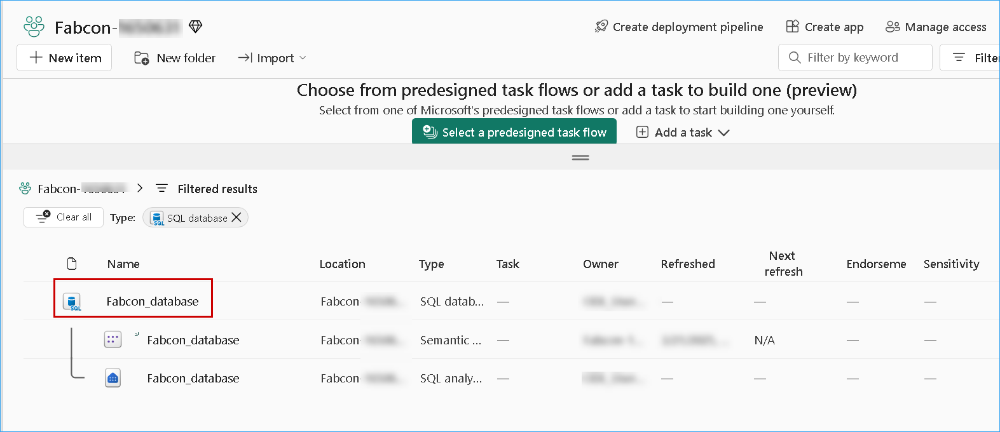
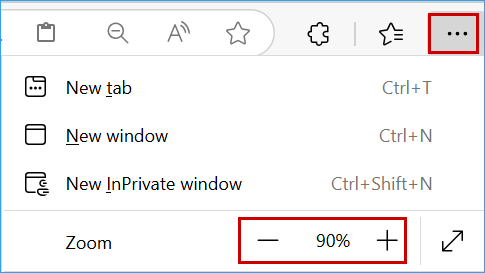

## Exercise 1: Loading Data into SQL Database

This module covers the basics of getting started with **SQL Database in Microsoft Fabric**. You will learn how to **create workspaces**, create a **SQL Database in Microsoft Fabric**, and **seed the database** with initial data that will be used in later modules. You will see how simple it is to create the databases by providing a name. And even more exciting, loading the initial data into SQL Database can be achieved without any code! This reduces maintenance effort while delighting developers!

---
>**Note:** Follow the steps provided in the task below. The Click-by-Click is available as a **backup option** in case of any technical issues preventing you from performing the lab in the actual environment.
Before starting this exercise, open a backup Click-by-Click using the following hyperlink in a new tab, then return to the browser.
[Click-by-Click](https://regale.cloud/Microsoft/play/4463/01-loading-data-into-sql-database#/0/0)
---

### Task 1.1: Load Data from Azure SQL Database

In this task, we will use **Dataflow Gen2** to ingest data and efficiently copy it from **Azure SQL Database** to **SQL database in Fabric**.

#### Activity: Create a new Fabric workspace

1. Open **Microsoft Fabric** in a new tab by copy pasting the below link.

   ```BASH
   https://app.fabric.microsoft.com/home
   ```

2.  **Sign in** with your **Azure AD** credentials. If you are not already signed in, you will be redirected to the Microsoft Fabric login page.

    >**Note:** Close any pop-up that appears on the screen.

    

    

3. From the left navigation pane, click on **Workspaces** and then the **+ New workspace** button.

   

4. In the **Name** field, enter **<inject key="WorkspaceName" enableCopy="true"/>**, then click **Apply**.

    > **Note:** Only use the workspace name provided above.
    
    > **Note:** If any pop-up appears on *Premium Capacity Settings*, click on **Got it** button.

    

    > **Note:** Wait for the Power BI Workspace to load.

    > **Note:** If the **Introducing Task Flows(preview)** pop-up appears, click **Got it**.

     


#### Activity: Create a new SQL Database in Fabric

1. Click on **+ New item** and type **SQL** in the search bar, then select **SQL Database (preview)**.

   

2. In the **Name** field, enter **Fabcon_database** and click on the **Create** button. Database creation should take less than a minute.

   ```
   Fabcon_database
   ```

   

3. When the new database is provisioned, on the **Home page** notice that the Explorer pane is showing database objects.

   

4. Under **Build your database**, three useful tiles can help you get your newly created database up and running.

   

   >**Note** : If you cannot see all the tiles shown in the screenshot, use the arrow mark above to navigate through the remaining tiles.

    

- **Sample data** - Lets you import sample data into your Empty database.
- **T-SQL** - Gives you a web-editor that can be used to write T-SQL to create database objects like schema, tables, views, and more. For users who are looking for code snippets to create objects, they can look for available samples in the **Templates** drop down list at the top of the menu.
- **Connection strings** - Shows the SQL database connection string that is required when you want to connect using **SQL Server Management Studio**, the mssql extension with **Visual Studio Code**, or other external tools.


#### Activity: Use Dataflow Gen2 to move data from Azure SQL DB to the SQL Database in Fabric.

1. In the New SQL Database, under ```Build your data - Start getting data``` click on the **New Dataflow Gen2**.

   

2. If the pop-up below appears, accept the default name and click the **Create** button.

   

   > **Note:** If the pop-up does not appear, wait for 30 seconds for Dataflow Gen 2 to be created.

3. Click on the **Get data** icon (**not on the dropdown arrow**).

   

   >**Note:** If the **Get Data** icon is not visible, expand **New Query** and select the **Get Data** option.

   

4. On the **Choose data source** pane, search for **Azure SQL** and click on **Azure SQL database**.

   

5. On the **Connection settings** pane, in the **Server** field, paste the following value **<inject key="MssqlServer" enableCopy="true"/>**.
6. In the **Database** field, paste ```SalesDb```.

   ```
   SalesDb
   ```

    


7.  Scroll down and select **Basic** for Authentication kind, enter **labsqladmin** as the **Username**, **Smoothie@2025** as the **Password** and click **Next**.

    ```BASH
    labsqladmin
    ```
    ```BASH
    Smoothie@2025
    ```

    

8. Select ``Suppliers``, ``Website_Bounce_rate`` and ``inventory`` tables, then click on the **Create** button.

   

9. Click on the ``Suppliers`` table, select the **Add data destination** option from the ribbon, then select **SQL database** from the list.

   >**Note:** If the **Data destination** is already added as **SQL Database**, skip to **Step 14**.

   

10. Click on the **Next** button.

   

11. Expand the **<inject key="WorkspaceName" enableCopy="false"/>** folder, select the **Fabcon_database** and then click on the **Next** button.

    

12. Click on the **Save settings** button.

    

13. For ``Website_Bounce_rate`` and ``inventory`` tables perform steps **8-11** to select the destination.

    >**Note:** Please ensure to select the destination for all the tables before publishing the dataflow.

14. Click on the **Publish** button.

    

    >**Note:** Wait for the Dataflow to complete, it will take 2-3 minutes.

15. Click on the **Bell** icon at the top right of the screen to verify the status of the Dataflow Gen2.

   
    

#### Activity: Verify the data transfer by querying tables in the SQL Database

1. Click on **Workspaces** and select the **<inject key="WorkspaceName" enableCopy="false"/>** workspace.

   

2. Search for **SQL Database** and select the **Fabcon_database**.

   

3. Click on the **Refresh** icon to see the tables loaded in Schema.

   

4. Click on the **New Query** icon.

   

5. Paste the query ```SELECT * FROM inventory```, click on the **Run** icon and then check the output.

   ```
   SELECT * FROM inventory
   ```

   


### Task 1.2: Load Data from On-Premises Database


Data Factory for Microsoft Fabric is a powerful cloud-based data integration service that allows you to create, schedule, and manage workflows for various data sources. In scenarios where your data sources are located on-premises, Microsoft provides the On-Premises Data Gateway to securely bridge the gap between your on-premises environment and the cloud. 

For this workshop, the **On-Premises Data Gateway** is already provisioned for you and no setup is required by the workshop user, the **gateway connection** can be accessed in your Fabric workspace while setting up the data pipeline. The connection is displayed automatically when database credentials passed on in the pipeline.

#### Activity: Use a Fabric Pipeline to load data from the On-premises database to the SQL Database

1. Click on **Workspaces** and select the **<inject key="WorkspaceName" enableCopy="false"/>** workspace.

   

2. Click on **+ New item** and select the **Data pipeline** option.

   

3. In the name field, enter ``Ingest on-premises data using pipeline``and click on the **Create** button.

   ```
   Ingest on-premises data using pipeline
   ```
   

4. From the **Home** tab of the pipeline editor, click on the **Copy data** dropdown and select **Use copy assistant** option.

   

5. On the **Home** pane, select the **SQL Server database** option.

    

6. In the **Connection settings** pane, in the **Server** field paste **LabVM-1653224** , and paste **FabconDatabase** in the **Database** field. It automatically selects the **Connection**. Click on the **Next** button.

    ```
    LabVM-1653224
    ```
    ```
    FabconDatabase
    ```

   >**Note:** For this workshop, the **On-Premises Data Gateway** is already provisioned for you and no setup is required by the workshop user, the **gateway connection** can be accessed in your Fabric workspace while setting up the data pipeline. The connection is displayed automatically when database credentials passed on in the pipeline.

   

7. Now, under the **FabconDatabase** database, click **Select all** and then click on the **Next** button.

   

8. Click on **OneLake** and select existing **SQL database**.

   

   > **Note :** If you don't see **Fabcon_database**, click the **ellipsis** in the top right corner and adjust **JumpVM's** screen resolution to 90%.

   

#### Activity: Validate the data transfer and ensure schema compatibility

1. Select the **Load to new table** radio button and wait for the **column mapping** to appear.
2. Click on the **Next** button.

   

3. Under Options, ensure that **Start data transfer immediately** remains **enabled** (default setting).

4. Click on **Save + Run** to proceed.

   

5. Click on the **Ok** button in the **Pipeline run** window..

   

6. Click on the **Bell** icon at the top right of the screen to verify the Running status of the pipeline.

   

   There you go! Your data has been transferred from the on-premises SQL database to the Fabric SQL database.

   Congratulations! You have successfully created your database in a new Fabric workspace and ingested data from both **Azure SQL Database** and an **on-premises SQL Server**.
   You are ready to move on to the next exercise: Introduction to Copilot for SQL Database.
   Move to the next page to continue!
