### Exercise 2: Introduction to Copilot for SQL Database

In this exercise, you will use **Copilot** to assist with T-SQL queries, including **auto-suggestions**, **fixing error**, and **natural language query**, again contributing to Contoso developer efficiency!

#### Task 2.1: Use Copilot in SQL Database

#### Activity: Write SQL queries in the SQL query editor in Microsoft Fabric

1. Click on **Workspaces** from the left navigation pane and select the **<inject key="WorkspaceName" enableCopy="false"/>** workspace.

   

2. Search for **database** and select the **Fabcon_database** created in the previous task.

   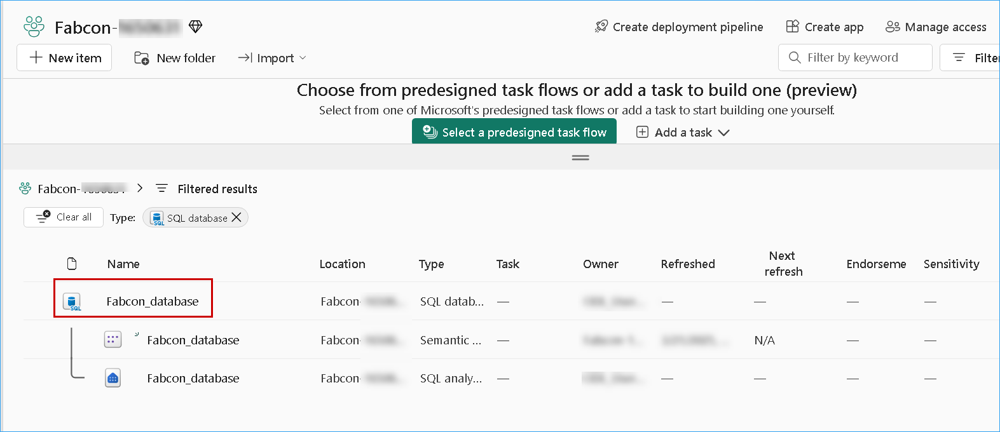

3. Click on the **New Query** icon.

   

4. Paste the query ```SELECT * FROM dimcustomer```, click on the **Run** icon and then check the output.

   ```
   SELECT * FROM dimcustomer
   ```

   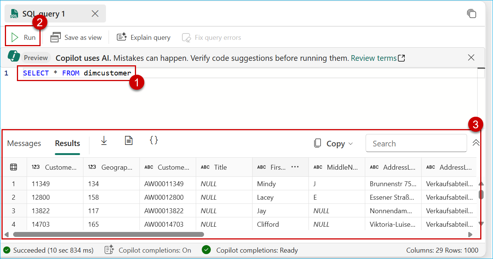

5. In the **Query Editor**, paste the query ```SELECT TOP(10) ``` and observe how Copilot suggests code to complete your query.

   ```
   SELECT TOP(10)
   ```
    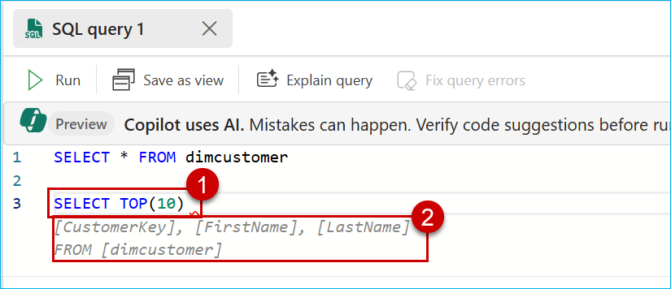

    >**Note:** 
    - Copilot responses may not match what is shown in the screenshot but will provide similar results.

    - If the Copilot-suggested response is not visible, refresh Fabcon_database and try again.  

      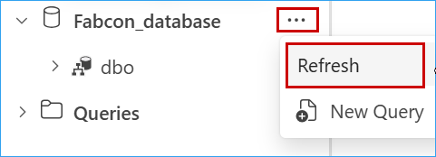

6. Press the **Tab** key on your keyboard to accept the suggestion or continue typing to ignore it.

   

7. Select the query and click on the **Run** icon.

   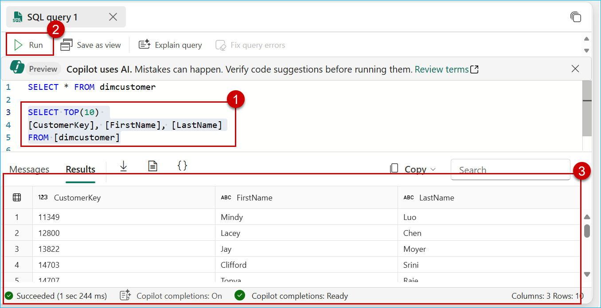


### Task 2.2: Fixing errors with Quick Actions

1. Paste the following query with a syntax error and click on the **Run** icon.

    ```
    SELECT d.CalendarYear, SUM(f.SalesAmount) AS TotalSalesAmount
    FROM dbo.factinternetsales f
    JOIN dbo.dimdate d ON f.OrderDateKey = d.DateKey
    GROUP BY d.CalYear
    ORDER BY d.CalendarYear;

    ```
   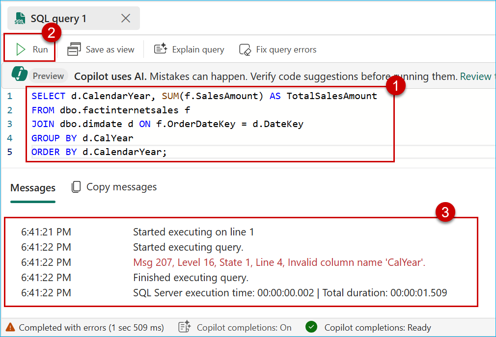

2. Click on **Fix query errors** and observe the updated query along with the comment that clearly states where the issue was in the query. Then, click on **Run** to see the results.

    >**Note:** Copilot responses may not match what is shown in the screenshot but will provide similar results.

   

### Task 2.3: Chat Pane : Natural Language to SQL

1. Click on the **Copilot** option.

   

2. Click on the **Get started** button.

   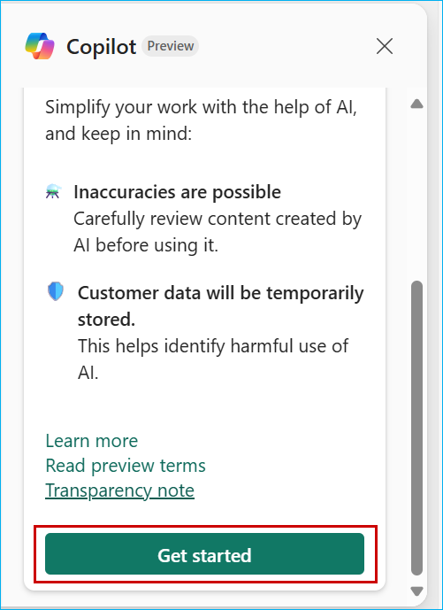

3. Paste the following question in the **Copilot** chat box and click on **Send**.

    ```
    What is the most sold product?
    ```

    >**Note:** Copilot responses may not match what is shown in the screenshot but will provide similar results.

    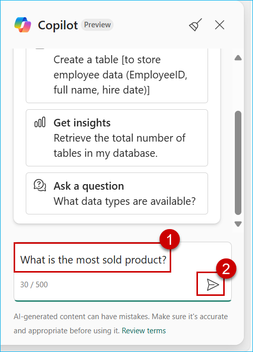

4. Click on the **Insert** button.

   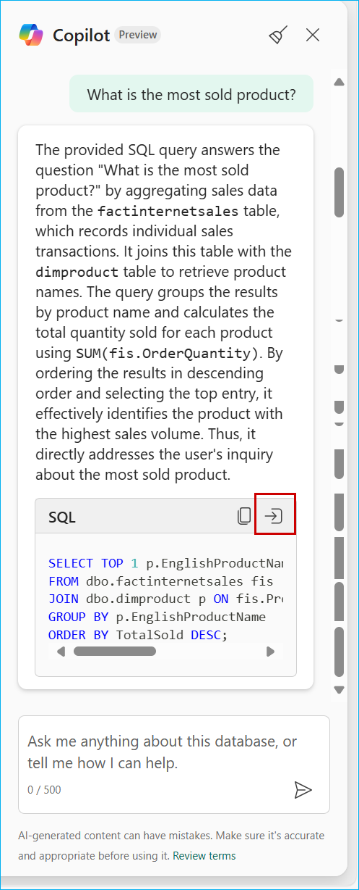

5. Select the query that was inserted by Copilot, click on the **Run** icon and check the **Results**.

   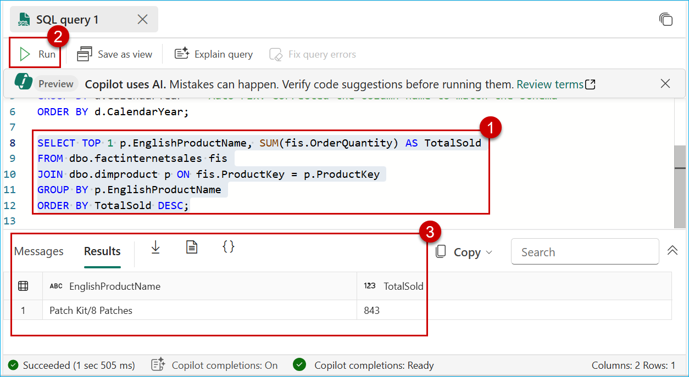

6. Paste the following question in the Copilot chat box and click on **Send**.

    >**Note:** Copilot responses may not match what is shown in the screenshot but will provide similar results.

    ```
    Who are the top 5 customers by total sales amount?
    ```

   

7. Click on the **Insert** button.

   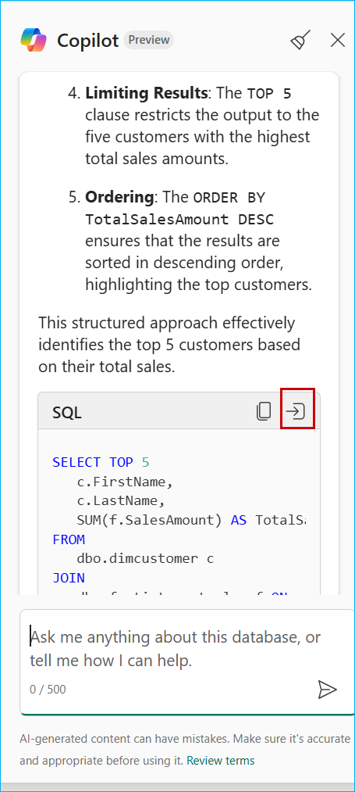

8. Select the query that was inserted by Copilot, click on the **Run** icon and check the **Results**.

   

    Congratulations! You have learned how to leverage **Copilot** for SQL Database in Microsoft Fabric to enhance your **query-writing** experience. With these skills, you are now better equipped to write SQL queries faster and troubleshoot errors effectively using Copilot. You are ready to move on to the next exercise: Data Enrichment and Transformation.
