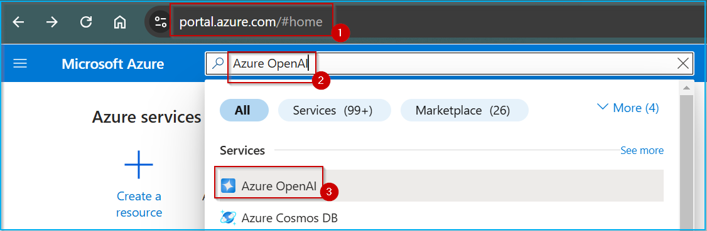
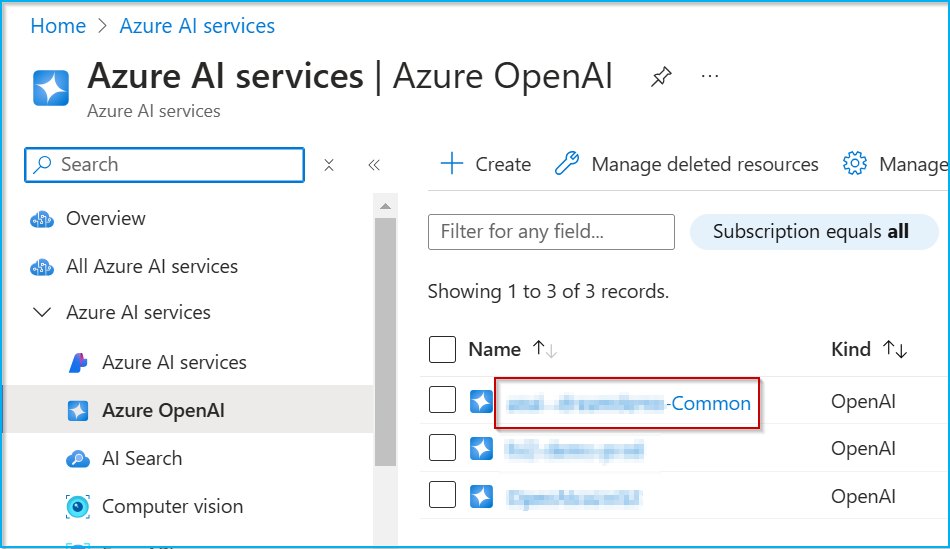
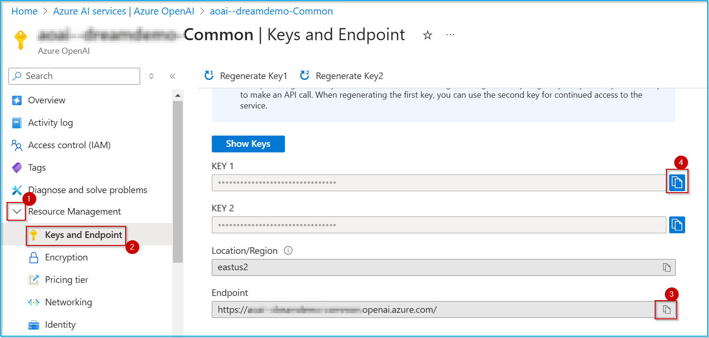
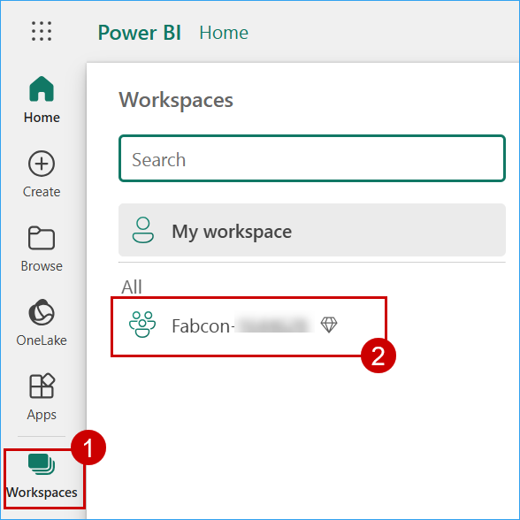

## Exercise 6: RAG Implementation with Azure OpenAI

In this exercise, we will implement a **Retrieval-Augmented Generation (RAG) system** in Microsoft Fabric by utilizing a **Fabric SQL database** as the **vector store**, Azure OpenAI for text embeddings, and the GPT-4 model to enhance natural language queries and responses.

### Activity: Get model URLS

1. Open a new tab and go to **https://portal.azure.com/**, search for **Azure OpenAI** in the search bar, then select the result.

   

2. Click on the **OpenAI-<inject key="Deployment ID" enableCopy="false"/>** resource.

   

3. Expand **Resource Management**, go to **Keys and Endpoint**, click on **Copy icon** next to Endpoint. Store the value and replace it wherever {endpointurl} appears in following exercise.

4. Click on **Copy icon** next to 'KEY 1'. Store the value and replace it wherever {endpointkey} appears in following exercise.

   


### Task 6.1: AI-Powered Recommendations with Vector Search

With Retrieval Augmented Generation, you can bridge structured data with generative AI, enhancing natural language queries across applications. Fabric SQL database, now has support to perform vector operations directly in the database, making it easy to perform vector similarity search. Once the Azure OpenAI model is deployed, it can be called from Fabric SQL database using sp_invoke_external_rest_endpoint, to get the embedding vector.

1. Click on **Workspaces** and select the **Fabcon-<inject key="Deployment ID" enableCopy="false"/>** workspace.

   

2. Click on **Fabcon_database** 

   

3.  Click on **New Query**, paste the query below, and then click on **Run**.
Below query creates a master key and a database credential.The credential is used by the database to access to the external location anytime the database is performing an operation that requires access.

    > **Note:** You can provide your own password instead of Smoothie@123 in the following code.

    > **Note:** Replace {endpointurl} and {endpointkey} with the copied values from earlier. Remove the curly brackets {} while replacing values.

    ```
    CREATE MASTER KEY ENCRYPTION BY PASSWORD = 'Smoothie@123';

    CREATE DATABASE SCOPED CREDENTIAL [{endpointurl}] 
    WITH IDENTITY = 'HTTPEndpointHeaders',
    SECRET = '{"api-key": "{endpointkey}"}';

    SELECT * 
    FROM sys.database_scoped_credentials
    WHERE name = '{endpointurl}';

    ```
    

4. Click on **New Query**, paste the query below, and then click on **Run**. 
Below query defines a stored procedure that converts text into an embedding (vector representation) using an external OpenAI API. 

   > **Note:** Replace {endpointurl} and {endpointkey} with the copied values from earlier. Remove the curly brackets {} while replacing values.

    ```
    create or alter procedure [dbo].[get_embedding]
    @inputText nvarchar(max),
    @embedding vector (1536) output
    as
    begin try
        declare @retval int;
        declare @payload nvarchar(max) = json_object('input': @inputText);
        declare @response nvarchar(max)
        DECLARE @headers NVARCHAR(MAX) = JSON_OBJECT(
        'Content-Type': 'application/json',
        'api-key': '{endpointkey}' 
    );
        exec @retval = sp_invoke_external_rest_endpoint
            @url = '{endpointurl}openai/deployments/text-embedding-ada-002/embeddings?api-version=2023-05-15',
            @method = 'POST',
            @credential = [{endpointurl}],
            @payload = @payload,
            @response = @response output;
    end try
    begin catch
        select 
            'SQL' as error_source,
            error_number() as error_code,
            error_message() as error_message
        return;
    end catch

    if (@retval != 0) begin
        select 
            'OPENAI' as error_source,
            json_value(@response, '$.result.error.code') as error_code,
            json_value(@response, '$.result.error.message') as error_message,
            @response as error_response
        return;
    end;

    declare @re nvarchar(max)= json_query(@response, '$.result.data[0].embedding')
    set @embedding = cast(@re as vector(1536));

    ```
   

5. Click on **New Query**, paste the query below, and then click on **Run**.
Below query loops through product names in a table, generates embeddings for each, and stores them in a new table.

    ```
    -- Step 1: Create a temporary table to store the results
    CREATE TABLE dbo.Product_Embeddings (
        ProductName NVARCHAR(MAX),
        Description NVARCHAR (MAX),
        EmbeddedName VECTOR(1536)
    );

    CREATE TABLE dbo.ChatMessages (
        MessageID INT IDENTITY(1,1) PRIMARY KEY,
        UserSessionID UNIQUEIDENTIFIER,
        MessageType NVARCHAR(10),  -- 'User' or 'AI'
        MessageText NVARCHAR(MAX),
        CreatedAt DATETIME DEFAULT GETDATE()
    );

    -- Step 2: Declare variables for the procedure output
    DECLARE @ProductName NVARCHAR(MAX);
    DECLARE @Description NVARCHAR(MAX);
    DECLARE @Embedding VECTOR(1536);

    -- Step 3: Loop through the dimproduct table
    DECLARE ProductCursor CURSOR FOR
    SELECT ProductName, Description
    FROM dbo.dim_products;

    OPEN ProductCursor;

    FETCH NEXT FROM ProductCursor INTO @ProductName, @Description;

    WHILE @@FETCH_STATUS = 0
    BEGIN
        -- Execute the procedure for each row
        EXEC [dbo].[get_embedding]
            @inputText = @ProductName,
            @embedding = @Embedding OUTPUT;

        -- Insert the result into the ProductEmbeddings table
        INSERT INTO dbo.Product_Embeddings (ProductName, Description, EmbeddedName)
        VALUES (@ProductName, @Description, @Embedding);

        -- Fetch the next row
        FETCH NEXT FROM ProductCursor INTO @ProductName, @Description;
    END;

    CLOSE ProductCursor;
    DEALLOCATE ProductCursor;

    ```
   

6. Click on **New Query**, paste the following query in the query editor, and then click on **Run**.
Below query retrieves and displays stored product embeddings.

    ```
    SELECT * FROM dbo.Product_Embeddings;
    ```
    

7. Click on **New Query**, paste the following query in the query editor, and then click on **Run**.
Below query defines a stored procedure to find the most relevant products by comparing embeddings using similarity metrics.

    > **Note:** Replace {endpointurl} with the copied values from earlier. Remove the curly brackets {} while replacing values.

```
    CREATE OR ALTER PROCEDURE [dbo].[find_relevant_products]
    @text NVARCHAR(MAX),
    @top INT = 10,
    @min_similarity DECIMAL(19,16) = 0.50,
    @JsonResults NVARCHAR(MAX) OUTPUT
    AS
    BEGIN
        IF (@text IS NULL) RETURN;

        DECLARE @RefinedQuery NVARCHAR(MAX);
        DECLARE @LLMResponse NVARCHAR(MAX);
        DECLARE @LLMRetval INT;
        DECLARE @LLMPayload NVARCHAR(MAX);

        SET @LLMPayload = 
        N'{
            "model": "gpt-4",
            "messages": [
                {
                    "role": "system",
                    "content": "You are an assistant that extracts the core product keyword(s) from a user''s query."
                },
                {
                    "role": "user",
                    "content": "Extract the key product name or keywords from the following query: ' 
                    + REPLACE(@text, '"', '\"') + '"
                }
            ],
            "temperature": 0.5,
            "max_tokens": 20
        }';

        EXEC @LLMRetval = sp_invoke_external_rest_endpoint
            @url = '{endpointurl}openai/deployments/gpt-4/chat/completions?api-version=2024-08-01-preview',
            @method = 'POST',
            @credential = [{endpointurl}],
            @payload = @LLMPayload,
            @response = @LLMResponse OUTPUT;

        -- Extract the refined query from the LLM response JSON
        SET @RefinedQuery = JSON_VALUE(@LLMResponse, '$.result.choices[0].message.content');

        IF (@RefinedQuery IS NULL OR LEN(@RefinedQuery) = 0)
            SET @RefinedQuery = @text;


        DECLARE @retval INT, @qv VECTOR(1536);

        EXEC @retval = dbo.get_embedding @RefinedQuery, @qv OUTPUT;

        IF (@retval != 0) RETURN;

        WITH cteSimilarEmbeddings AS (
            SELECT TOP(@top)
                pe.ProductName AS ProductName,
                pe.Description AS Description,
                vector_distance('euclidean', pe.[EmbeddedName], @qv) AS distance
            FROM dbo.Product_Embeddings pe
            ORDER BY distance
        )

        SELECT @JsonResults = (
            SELECT 
                -- p.id AS ProductId,
                p.ProductName AS ProductName
                -- p.description AS ProductDescription,
                -- p.price AS ProductPrice,
                -- 1 - distance AS CosineSimilarity
        
            FROM cteSimilarEmbeddings se
            
            INNER JOIN dbo.dim_products p ON se.ProductName = p.ProductName
        
            WHERE 1 - distance >= @min_similarity
            
            ORDER BY distance
            FOR JSON AUTO, ROOT('search_results')
        );
    END;

```
   


### Task 6.2: AI-Powered Natural Language result processing

Let's use the natural language understanding and reasoning capabilities of the LLM to analyzes the results and generate a response. We will query our Fabric SQL database, then send the result to Azure OpenAI GPT4 to generate a response in well formatted natural language chat messages.

1. Click on **New Query**, paste the following query in the query editor, and then click on **Run**.
Below query retrieves relevant products based on user input, generates a structured AI response via an external OpenAI API call, stores the conversation in a database, and returns formatted chat messages.

    > **Note:** Replace {endpointurl} with the copied values from earlier. Remove the curly brackets {} while replacing values.

```
    CREATE OR ALTER PROCEDURE dbo.get_ai_response
    @UserSessionID UNIQUEIDENTIFIER,
    @UserQuery NVARCHAR(MAX),
    @AIResponse NVARCHAR(MAX) OUTPUT
    AS
    BEGIN
        DECLARE @SearchResults NVARCHAR(MAX);

        -- Step 1: Fetch relevant products
        EXEC dbo.find_relevant_products @UserQuery, 10, 0.50, @SearchResults OUTPUT;

        -- Step 2: Ensure @SearchResults is not NULL or empty
        IF @SearchResults IS NULL OR LEN(@SearchResults) = 0
            SET @SearchResults = '{"search_results":[]}';  -- Prevent NULL errors

        DECLARE @CleanSearchResults NVARCHAR(MAX);
        SET @CleanSearchResults = REPLACE(@SearchResults, '"', '\"');

        -- Debugging: Display the search results before making API call
        -- SELECT @SearchResults AS DebugSearchResults;

        -- Step 3: Construct JSON payload correctly
        DECLARE @Payload NVARCHAR(MAX);
        SET @Payload = 
        N'{
            "model": "gpt-4",
            "messages": [
                {
                    "role": "system",
                    "content": "You are a helpful assistant providing structured product summaries in a clean, readable format. Use bullet points, avoid excessive markdown (like ### or ***), and remove redundant blank lines. Make responses interactive by encouraging the user to choose."
                },
                {
                    "role": "user",
                    "content": "Based on the following product search results, generate a structured yet conversational summary with emojis, bullet points, and minimal empty lines:\n\n' + @CleanSearchResults + '"
                }
            ],
            "temperature": 0.7,
            "max_tokens": 300
        }';

        -- Debugging: Display the payload before calling OpenAI API
        -- SELECT @Payload AS DebugPayload;

        -- Step 4: Call Azure OpenAI API
        DECLARE @retval INT, @response NVARCHAR(MAX);
        
        EXEC @retval = sp_invoke_external_rest_endpoint
            @url = '{endpointurl}openai/deployments/gpt-4/chat/completions?api-version=2024-08-01-preview',
            @method = 'POST',
            @credential = [{endpointurl}],
            @payload = @Payload,
            @response = @AIResponse OUTPUT;

        DECLARE @NaturalLanguageResponse NVARCHAR(MAX);
        SET @NaturalLanguageResponse = JSON_VALUE(@AIResponse, '$.result.choices[0].message.content');

        -- Step 5: Split AI response into separate messages and store in ChatMessages
        DECLARE @Pos INT = 1, @Line NVARCHAR(MAX), @Delimiter NVARCHAR(2) = CHAR(10);
        
        -- Step 6: Store the structured response in the database
        INSERT INTO dbo.ChatMessages (UserSessionID, MessageType, MessageText)
        VALUES (@UserSessionID, 'User', @UserQuery);

        -- Loop through AI response, splitting it into rows
        WHILE CHARINDEX(@Delimiter, @NaturalLanguageResponse, @Pos) > 0
        BEGIN
            SET @Line = LEFT(@NaturalLanguageResponse, CHARINDEX(@Delimiter, @NaturalLanguageResponse, @Pos) - 1);
            SET @NaturalLanguageResponse = STUFF(@NaturalLanguageResponse, 1, CHARINDEX(@Delimiter, @NaturalLanguageResponse, @Pos), '');

            -- Store each line separately
            INSERT INTO dbo.ChatMessages (UserSessionID, MessageType, MessageText)
            VALUES (@UserSessionID, 'AI', @Line);
        END;

        -- Store any remaining text
        IF LEN(@NaturalLanguageResponse) > 0
        BEGIN
            INSERT INTO dbo.ChatMessages (UserSessionID, MessageType, MessageText)
            VALUES (@UserSessionID, 'AI', @NaturalLanguageResponse);
        END;

        -- Step 6: Return AI response as multiple rows
        SELECT 
            CASE 
                WHEN MessageType = 'User' THEN 'User: ' + MessageText
                WHEN MessageType = 'AI' THEN 'AI: ' + MessageText
            END AS ChatMessage
        FROM dbo.ChatMessages
        WHERE UserSessionID = @UserSessionID
        ORDER BY CreatedAt ASC;
    END;
```

   

2. Click on **New Query**, paste the following query in the query editor, and then click on **Run**. 
Below query calls the search procedure to retrieve the closest matching products based on an input text.

    ```
    --- Question 1: find me phones
    DECLARE @UserSessionID UNIQUEIDENTIFIER = NEWID();
    DECLARE @AIResponse NVARCHAR(MAX);

    EXEC dbo.get_ai_response @UserSessionID, 'find me a smartphone with good camera', @AIResponse OUTPUT;
    SELECT @AIResponse AS GPT_Response;
    ```
   


In this exercise, you have explored Retrieval Augmented Generation (RAG) to enhance natural language queries using Fabric SQL database and Azure OpenAI GPT-4. You have gained practical experience in:
    
- Performing vector operations directly within the Fabric SQL database to enable vector similarity searches.
- Using sp_invoke_external_rest_endpoint to call an Azure OpenAI model for generating embedding vectors.
- Asking questions and retrieving relevant answers from the Fabric SQL database.
- Sending questions and answers to Azure OpenAI GPT-4 to generate responses in natural language.

With these skills, you can now bridge structured data with generative AI to improve query understanding and response generation. You are ready to move on to the next exercise [Data Security and Compliance](https://github.com/dreamdemos-ms/Fabcon_Workshop/blob/main/Workshop_Exercises/07%20-%20Data%20Security%20and%20Compliance.md)
