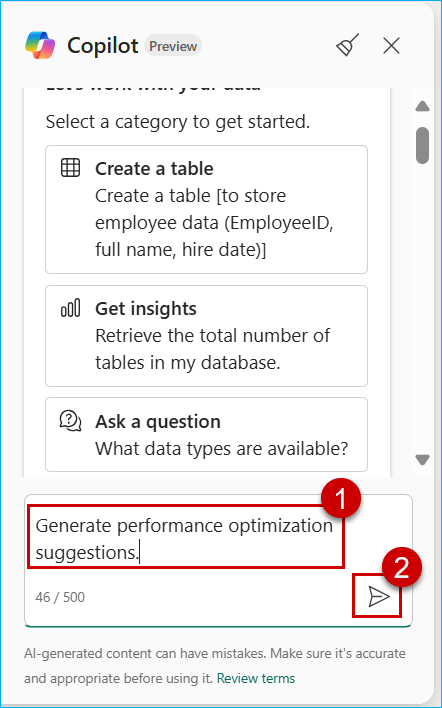

### Exercise 8: Managing Production Workloads

In this exercise, we will explore different **SQL Database performance metrics** available in Microsoft Fabric and enable **version control** to track database changes efficiently. The simple and autonomous capability of SQL Database in Microsoft Fabric can take a novice developer from not knowing anything about databases to be maintaining the database in a short period of time - indexes get automatically created based on the queries that are running in the database. This kind of work was manual work done by a DBA in the past. How cool is that?

### Task 8.1: Monitor SQL Database Performance

#### Activity: Analyze metrics like CPU usage, connections, and query performance.

The Performance Dashboard in Fabric SQL database displays the performance status of the database and offers varying levels of metrics visibility.

You can use the Performance Dashboard to view database performance metrics, to identify performance bottlenecks, and find solutions to performance issues.

1. Click on **Workspaces** and select **<inject key="WorkspaceName" enableCopy="false"/>** workspace.

   

2. Search for **database** and select the **Fabcon_database**.

   

3. Click on **Performance summary**.

   

4. Take a look at the **Performance summary** and click on **View performance dashboard** button.

   

    When the database reaches a critical state of **CPU consumption** (or any other factor which raises an alert), you can see Unhealthy points marked on the CPU consumption tab's graph, marking points where the CPU consumption has crossed the threshold value. The time interval is configurable and defaults to 24 hours.

    In the following image, the CPU consumption graph indicates when the database reached a critical state.

    > **Note:** The following image is for educational purposes only. You will not see any unhealthy points marked on the CPU consumption tab's graph, as the CPU consumption is minimal for this workshop.

    

**Alert threshold criteria**

| Tab |Threshold| Criteria |
|----------|----------|----------|
| **CPU consumption**  | 80% of the allotted value|	If the monitor finds the CPU above the threshold for more than five minutes. The monitor checks at a frequency of one minute.|
| **Allocated Size** | 80% of the allotted size	|If the monitor finds the size above the threshold for more than five minutes. The monitor checks at a frequency of one minute.|
| **Blocked Queries**|	One Blocked Query |	If there is at least one blocked query which has been blocked for more than one minute. The monitor is expected to check this every three minutes.|

- **Performance dashboard tabs**

The following are built-in reporting areas of the Performance Dashboard.

- **CPU consumption**

The CPU consumption graph is plotted by vCore seconds. The Top Consuming CPU queries identifies the queries in the desired time interval that have been most responsible for vCore consumption.

- **User connections**

The User connections graph tracks user current connections to the database, with information about each connection. The User connections (current) table lists the current user connections in the table.

1. Click on **User connections** tab.

 

- **Requests per second**

The Requests per second graph tracks the cumulative number of times a query has been executed over a period. The Requests per second table contains the most frequently executed queries.

1. Click on **Requests per second** tab.


- **Blocked queries per second**

The Blocked queries per second graph tracks queries experience blocks due to locking. 

1. Click on **Blocked queries per second** tab.


In the SQL Database Engine, blocking occurs when one session holds a lock on a specific resource and a second SPID attempts to acquire a conflicting lock type on the same resource. Typically, the time frame for which the first SPID locks the resource is small. When the owning session releases the lock, the second connection is then free to acquire its own lock on the resource and continue processing. Blocking is normal behavior and might happen many times throughout the course of a day with no noticeable effect on system performance.

- **Allocated size**

The Allocated size tab provides a history of the size of the database. The Largest Database tables (current) table identifies of the tables which have the greatest number of records and consume the maximum space.

1. Click on **Allocated size** tab.


- **Automatic index**

Automatic indexing in databases automates index management, enhancing query performance and data retrieval speed. It adapts by identifying and testing potential indexes based on column usage. The feature improves overall database performance and optimizes resources by removing unused indexes.

The Automatic index tab report shows a history and status of automatically created indexes.

1. Click on **Automatic index** tab.


**Note:** If the **Automatic Index** option is not visible, click on the ellipsis (...) and select **Automatic Index**.


<!--
#### Use Copilot AI to generate performance optimization suggestions.

1. Click on **Copilot**.


2. Paste the following question in the Copilot chatbox.

```
Generate performance optimization suggestions.

```



3. Check the full response from Copilot for performance optimization suggestions for SQL Database.


-->

### Task 8.2: Deploy and Version-Control Workloads(Click By Click)

#### Activity: Integrate with Git repositories for version control

---
>**Note:** This exercise will be a Click-by-Click. Use the following link to perform the exercise. Once you complete the exercise using the ***Click-by-Click***, navigate back to the browser.
---

>Please follow the green beacons for this exercise.
- This exercise will be performed outside the VM browser.
- Please return back to the VM browser once you see the **End of this Exercise** screen.
- Once you press the **Agree** button, press the **A** key on your keyboard if you do not see the annotations.
	
1. Click on the [**hyperlink**](https://regale.cloud/Microsoft/play/4476/08-managing-production-workloads#/0/0)


In this exercise, you have learned how to monitor and optimize database performance using the Performance Dashboard in Microsoft Fabric SQL Database. You have gained practical experience in:
 
- Viewing database performance metrics to assess system health and efficiency.
- Identifying performance bottlenecks and diagnosing issues to enhance query execution.
- Integrating with Git repositories for version control of database objects and schema.
- Automating deployment of database schema and data for streamlined operations.

Now that you have these skills, you can now proactively manage database performance and implement efficient version control and deployment strategies.

With all the above transformations, you will help Contoso and April achieve an all-green dashboard. Imagine what you can do with SQL Database in Microsoft Fabric for your organization. The possibilities are limitless!

 Move to the next page to continue!


