### Exercise 8: Managing Production Workloads

in this exercise, we will explore different **SQL database performance metrics** available in Fabric and enable **version control** to track database changes efficiently.

### Task 8.1: Monitor SQL Database Performance

#### Activity: Analyze metrics like CPU usage, connections, and query performance.

The Performance Dashboard in Fabric SQL database displays the performance status of the database and offers varying levels of metrics visibility.

You can use the Performance Dashboard to view database performance metrics, to identify performance bottlenecks, and find solutions to performance issues.

1. Click on **Workspaces** and select **<inject key="WorkspaceName" enableCopy="false"/>** workspace.

   

2. Search for **database** and select the **Fabcon_database**.

   

3. Click on **Performance summary**.

   

4. Take a look at the **Performance summary** and click on **View performance dashboard** button.

   

    When the database reaches a critical state of **CPU consumption** (or any other factor which raises an alert), you can see Unhealthy points marked on the CPU consumption tab's graph, marking points where the CPU consumption has crossed the threshold value. The time interval is configurable and defaults to 24 hours.

    In the following image, the CPU consumption graph indicates when the database reached a critical state.

    > **Note:** The following image is for educational purposes only. You will not see any unhealthy points marked on the CPU consumption tab's graph, as the CPU consumption is minimal for this workshop.

    

**Alert threshold criteria**

| Tab |Threshold| Criteria |
|----------|----------|----------|
| **CPU consumption**  | 80% of the allotted value|	If the monitor finds the CPU above the threshold for more than five minutes. The monitor checks at a frequency of one minute.|
| **Allocated Size** | 80% of the allotted size	|If the monitor finds the size above the threshold for more than five minutes. The monitor checks at a frequency of one minute.|
| **Blocked Queries**|	One Blocked Query |	If there is at least one blocked query which has been blocked for more than one minute. The monitor is expected to check this every three minutes.|

- **Performance dashboard tabs**

The following are built-in reporting areas of the Performance Dashboard.

- **CPU consumption**

The CPU consumption graph is plotted by vCore seconds. The Top Consuming CPU queries identifies the queries in the desired time interval that have been most responsible for vCore consumption.

- **User connections**

The User connections graph tracks user current connections to the database, with information about each connection. The User connections (current) table lists the current user connections in the table.

1. Click on **User connections** tab.

 

- **Requests per second**

The Requests per second graph tracks the cumulative number of times a query has been executed over a period. The Requests per second table contains the most frequently executed queries.

1. Click on **Requests per second** tab.


- **Blocked queries per second**

The Blocked queries per second graph tracks queries experience blocks due to locking. 

1. Click on **Blocked queries per second** tab.


In the SQL Database Engine, blocking occurs when one session holds a lock on a specific resource and a second SPID attempts to acquire a conflicting lock type on the same resource. Typically, the time frame for which the first SPID locks the resource is small. When the owning session releases the lock, the second connection is then free to acquire its own lock on the resource and continue processing. Blocking is normal behavior and might happen many times throughout the course of a day with no noticeable effect on system performance.

- **Allocated size**

The Allocated size tab provides a history of the size of the database. The Largest Database tables (current) table identifies of the tables which have the greatest number of records and consume the maximum space.

1. Click on **Allocated size** tab.


- **Automatic index**

Automatic indexing in databases automates index management, enhancing query performance and data retrieval speed. It adapts by identifying and testing potential indexes based on column usage. The feature improves overall database performance and optimizes resources by removing unused indexes.

The Automatic index tab report shows a history and status of automatically created indexes.

1. Click on **Automatic index** tab.


**Note:** If the **Automatic Index** option is not visible, click on the ellipsis (...) and select **Automatic Index**.


<!--
#### Use Copilot AI to generate performance optimization suggestions.

1. Click on **Copilot**.


2. Paste the following question in the Copilot chatbox.

```
Generate performance optimization suggestions.

```


3. Check the full response from Copilot for performance optimization suggestions for SQL Database.


-->

### Task 8.2: Deploy and Version-Control Workloads(Click By Click)

#### Activity: Integrate with Git repositories for version control

1. Sign in to your organization (https://dev.azure.com/{Your_Organization}) 


2. Select project you want to do Git integration and make sure the Branch **Initialize** is done.

    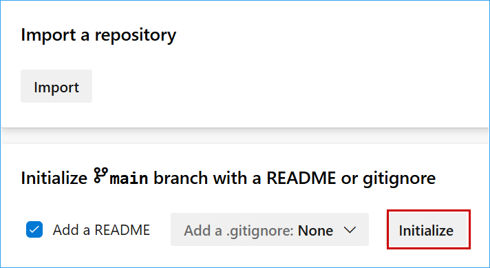

3. Navigate to the Fabric Workspace and click on the **Workspace settings**.

    

5. under "Workspace settings" click on **Git integration** and click on **Azure DevOps** followed by click on **Connect**.

    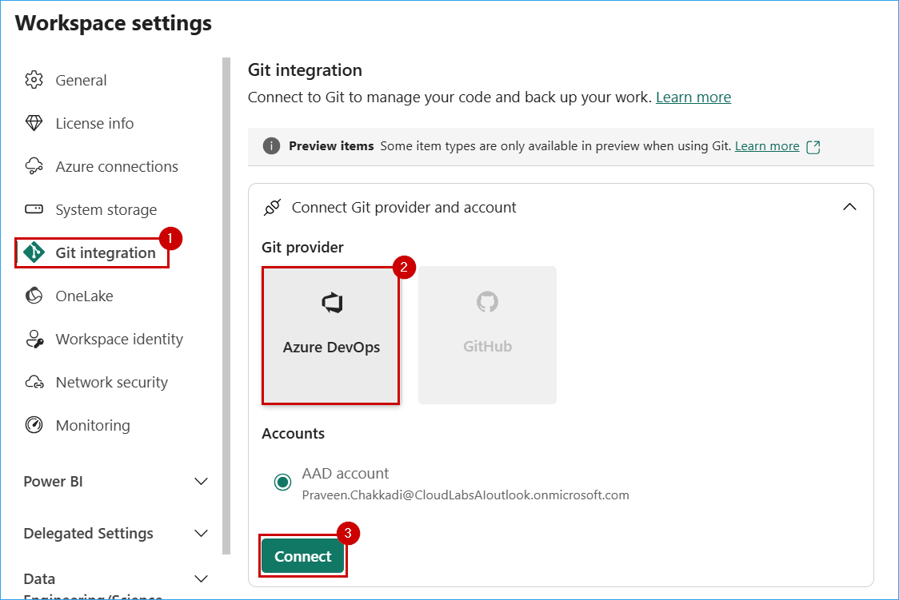

6. Connect Git repository and Branch
    - Select Organization
    - Select Project
    - Select Git repository
    - Select Branch
    - Provide a name to create a Git Folder as **Fabric Git Integration**
    - Click on **Connect and sync**

    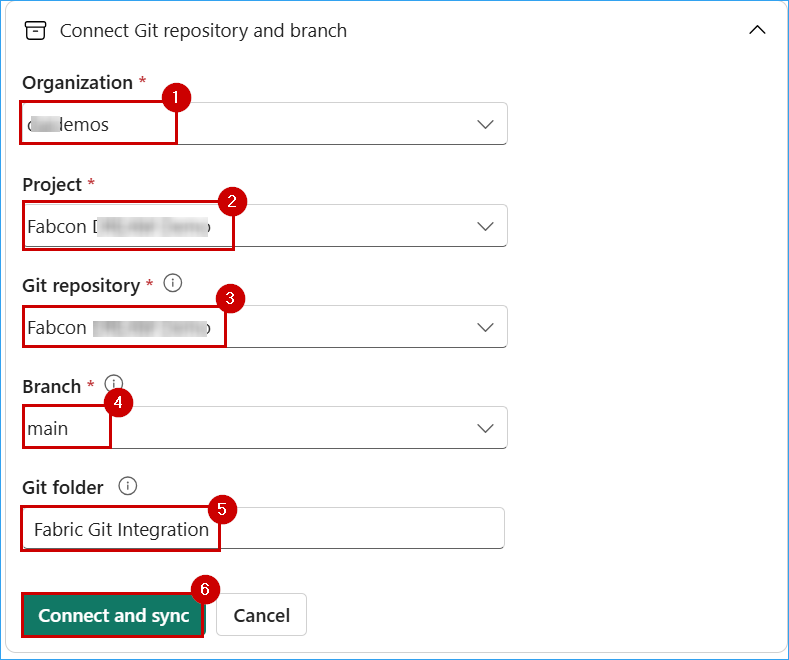

7. up on the pop-up of "Create a new folder?" click on **Create and sync**

    

8. Confirm "Git status" is **synced**.

    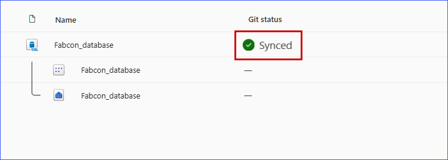

#### Activity: Automate deployment of database schema and data.    

1. Go to the Azure DevOps and click on the **Repos** and click on the **Fabric Git Integration** folder and click on the Branch dropdown and **+ New branch** to create new "dev" branch.

    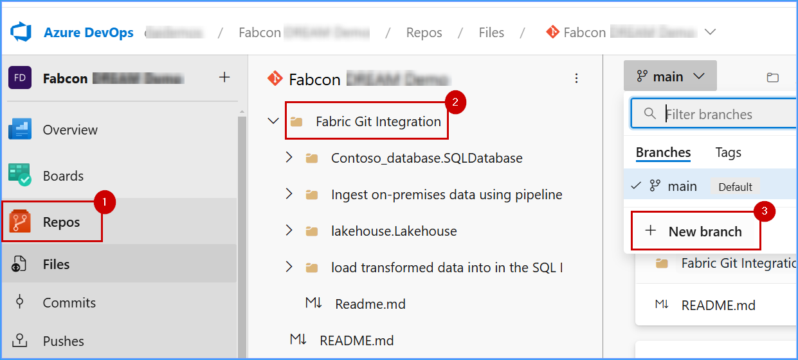

2. Up on the popup "Create a branch" provide the Name as **dev** and Based on **main** and click on **Create**.

    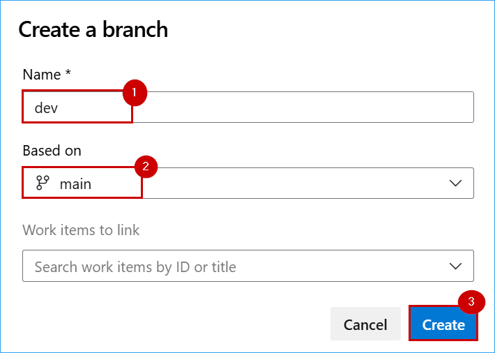

3. Click on the main and select the **dev** branch.

    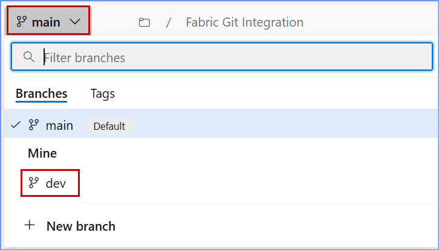

4. Once switch to the **dev** branch.
    - Click on the *Fabric Git Integration*
    - click on the dropdown *Contoso_databse.SQLDatabase*
    - Click on the (three dots) ellipse of the security folder.
    - click on the **+ New** and click on **File**.

    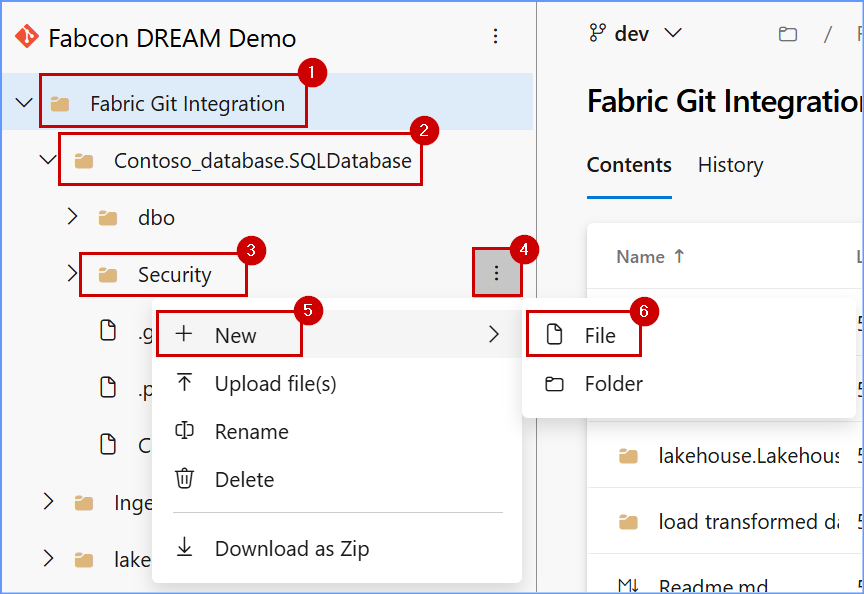

5. In the *New file* Popup page provide New file name as **sales.sql** and click on **Create**.

    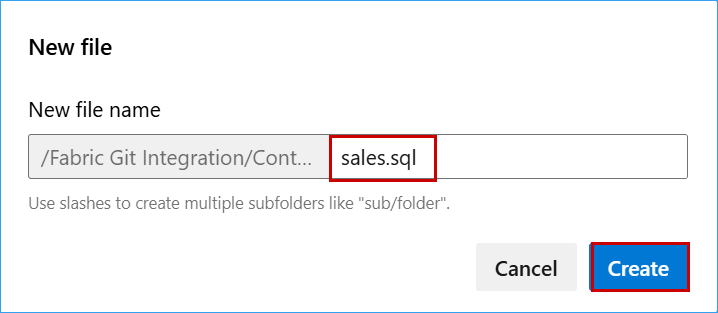

6. Provide the below sql query in the content section and click on **Commit**. The following query will create a new **schema**, **Sales**, and a **view** in it called **vw_TotalSalesByYear**.

    ```sql
    CREATE SCHEMA Sales
 
    CREATE VIEW Sales.vw_TotalSalesByYear AS
    SELECT
        d.CalendarYear,
        SUM(f.SalesAmount) AS TotalSalesAmount
    FROM
        dbo.factinternetsales f
    JOIN
        dbo.dimdate d ON f.OrderDateKey = d.DateKey
    GROUP BY
        d.CalendarYear;
    ```
    

7. Once you get the *Commit* popup page click on **Commit** button.

    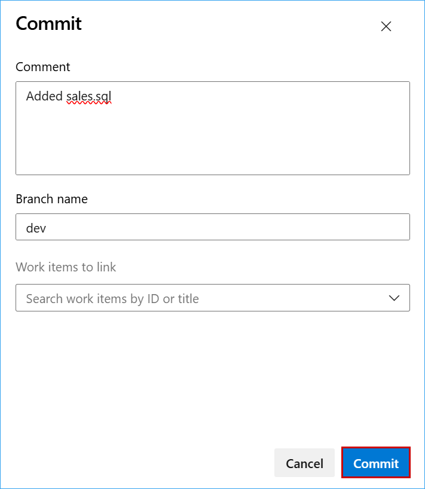

8. Click on **create a pull request** under **dev** branch.

    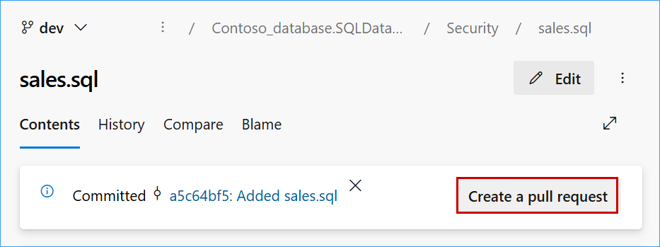

9. Up on the *New pull request* page verify the pull request is creating between *dev and main*. Provide the Reviewers Name and click on create.

    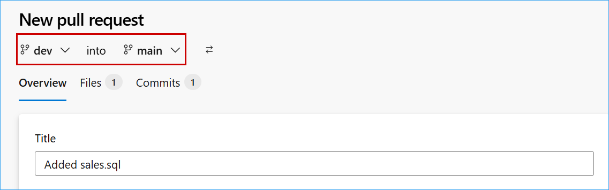
    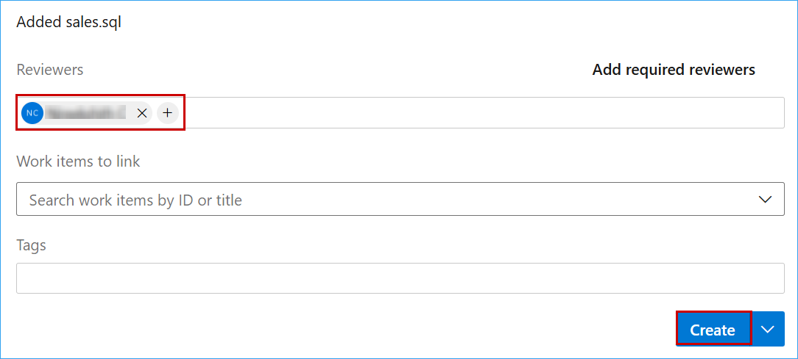

10. Once it is confirmed share the pull request to the person who needs to approve it.

11. Once it is approved click on the **Pull requests** and open the request you created and click on **Complete**.

    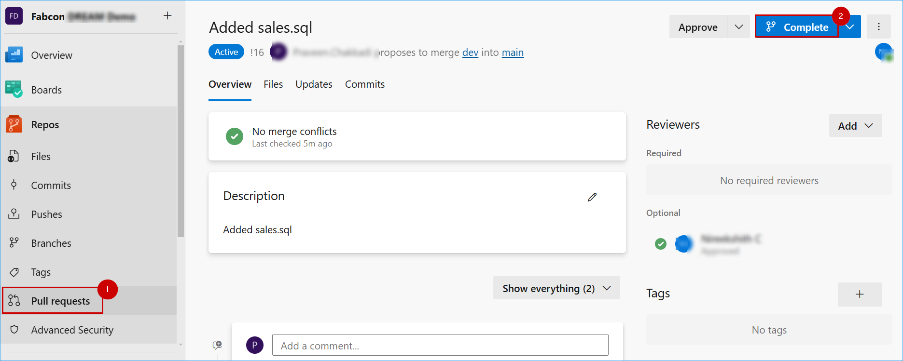

12. On the popup click of *Complete pull request* verify that the *delete dev after merging* is unchecked and click on **Complete megre**

    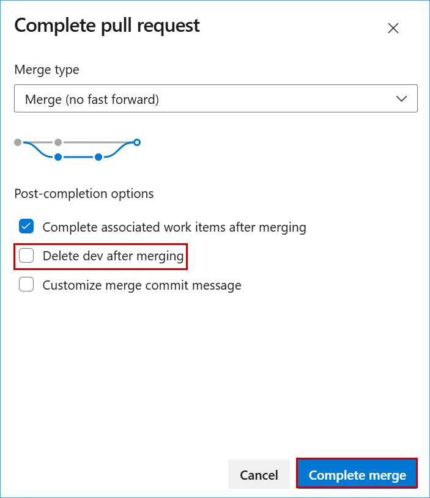

13. once the merge is completed go back to the main branch and under security verify the **sales.sql** file.

    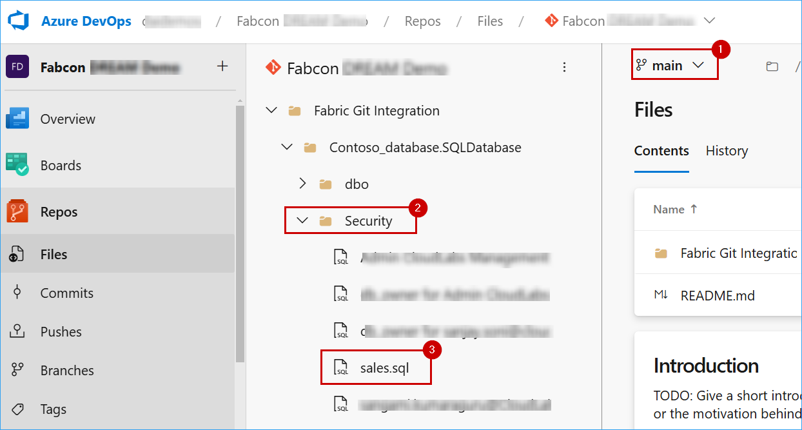

14. Go back to the Microsoft Fabric Workspace, and do a hard refresh with the Ctrl + shift + R.

15. Click on the **Source control** and click on **Update all** and under the changes click on **Commit** to keep it in sync.

    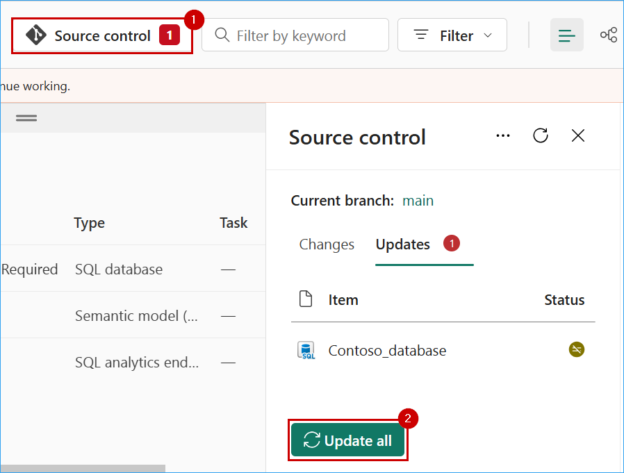

16. Once the update is completed, click on the **SQL Database**

    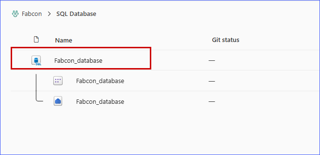

17. Verify that the **sales** schema appears in the SQL database under Explorer and that a **view** has been created.

    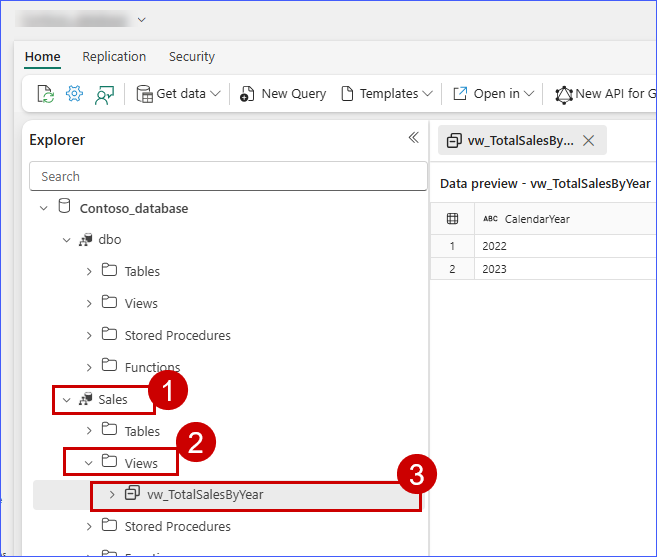


In this exercise, you have learned how to monitor and optimize database performance using the Performance Dashboard in Fabric SQL database. You have gained practical experience in:
 
- Viewing database performance metrics to assess system health and efficiency.
- Identifying performance bottlenecks and diagnosing issues to enhance query execution.
- Integrating with Git repositories for version control of database objects and schema.
- Automating deployment of database schema and data for streamlined operations.

With these skills, you can now proactively manage database performance and implement efficient version control and deployment strategies.


