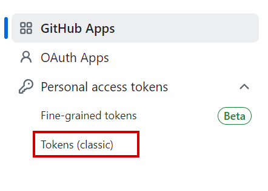
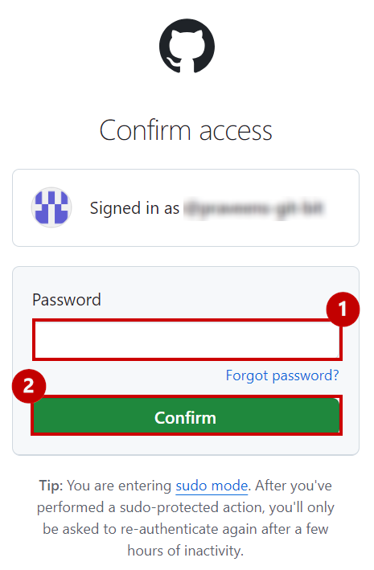
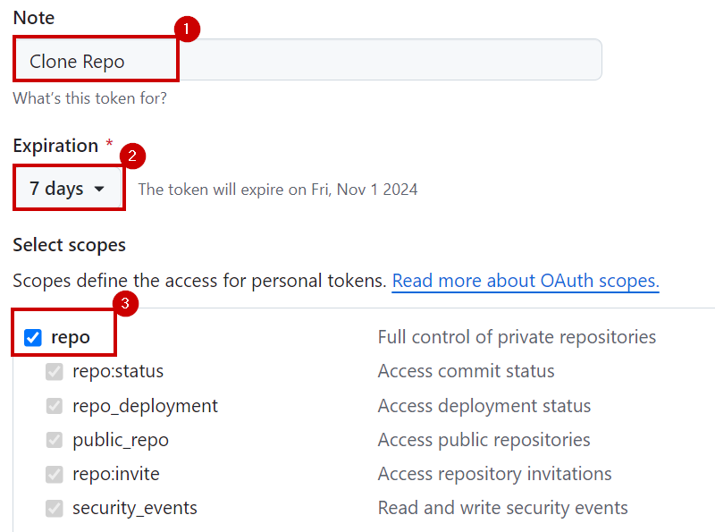
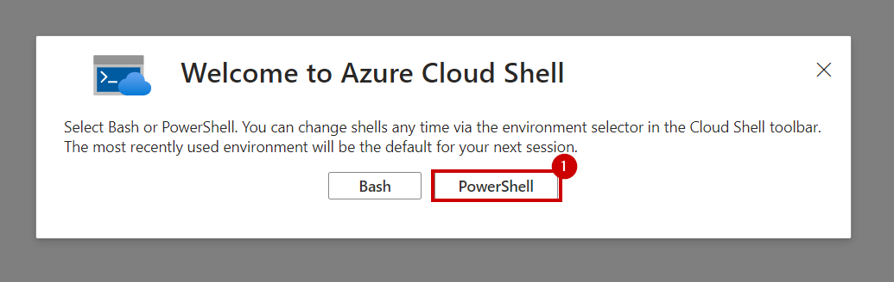
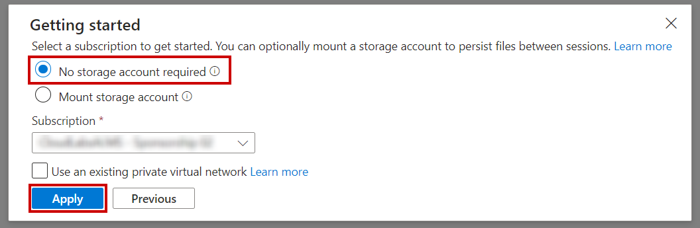
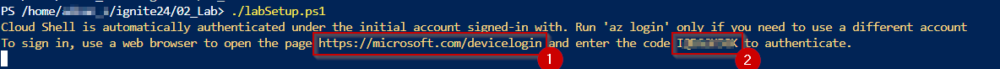
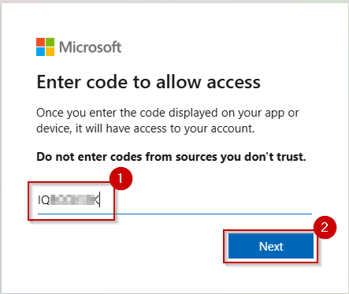
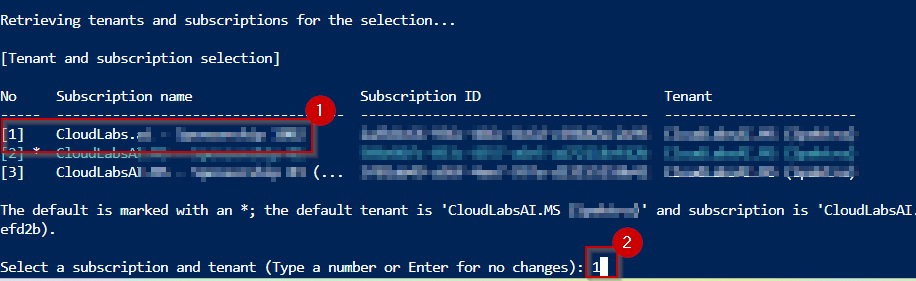
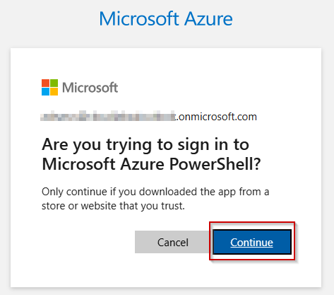

# Step-by-Step Instructions to Deploy an ARM Template Using PowerShell

## Prerequisite:
### Github Token extraction

1. Log into Github and click on the **Profile** Icon.


2. Scroll down the page and click on **Developer settings**.


3. Click on **Personal access tokens** dropdown and select **Tokens (Classic)**.



4. In the **Confirm Access** window, provide the password and click on the **Confirm** button.



5. Add a note in the **Note** textbox, select the expiration days from the **Expiration** dropdown, and select **repo** checkbox.



6. Click on the **Generate token** button.


7. Click on copy token from "clipboard" and save it for future reference.


## Deploying ARM Template using Cloud Shell

1. Log into Microsoft Azure portal and click on **Cloud Shell** icon from the menu bar.


2. Select **Powershell**.



3. Click on **No storage account required** button, then select the required subscription from the **Subscription** dropdown and click on **Apply**.



4. In the Cloudshell, enter the below command and press "enter".

```
git clone -b main --depth 1 --single-branch https://github.com/dreamdemos-ms/Fabcon_Workshop.git Fabcon
```


5. Enter your Github **username** and press the **Enter** key.

6. Paste the **token** generated in the Github Token extraction steps and press the **Enter** key.


**Note**: Wait till the clone completes as seen in the following screenshot.


7. Paste the following command in Powershell.

```
cd Fabcon
```


8. Check for the setup file using "ls" command and run the script with following command.

```
./Setup.ps1
```


9. Browse the **URL** in another tab of your browser and copy the **code**.

    

10. Paste the **code** and click on the **Next** button.

    

11. Select the **Azure account** to sign in.

     

12. Click on the **Continue** button.

    

13. When you see the below **screenshot**, close the tab of your browser and go back to the **Cloudshell tab**.

    

14. Select the desired subscription and then press the Enter key.

    

15. Browse the **URL** in another tab of your browser and copy the **code**.

    

16. Paste the **code** and click on the **Next** button.

    

17. Select the **Azure account** to sign in.

     

18. Click on the **Continue** button.

    

19. When you see the below **screenshot**, close the tab of your browser and go back to the **Cloudshell tab**.

    

20. Select the region as per your preference.

    

>**Note:** It takes approximately 10-15 minutes for the deployment

## Manual steps

1. Navigate to Azure Portal and open a resource group and connect with your VM using RDP

    

2. Open a new tab in your virtual machine browser and paste the follwing URL, it will download gateway application.

[Download the standard gateway](https://go.microsoft.com/fwlink/?LinkId=2116849&clcid=0x409)

3. In the gateway installer, keep the default installation path, accept the **terms of use**, and then select **Install**.


4. In **email address to use with this gateway** field, enter your Entra ID Username used for the deployment and then select **Sign in**.


5.  Enter your Entra ID Password used for the deployment and click on **Sign in**.


6. Select **Register a new gateway on this computer** and click on **Next**.


7. Enter a name for the gateway as **Datagateway** and in **Recovery Key** field enter key and enter the same value in **Confirm recory key** field and click on **Configure**.


8. Review the information in the final window. Note that the gateway is available for Microsoft Fabric. Select **Close**.


9. Navigate back to fabric and share this Gateway with Entra ID group created for the workshop.

## Set up a gateway connection to access on-premises data sources

1. Navigate to Azure portal(https://portal.azure.com/) and search for **Resoucegroup**.


2. Click on **rg-fabcon-suffix**, copy **virtual machine name** and save it on your notpad.


3. Navigate back to Microsoft Fabric tab, click on the **Settings** button (an icon that looks like a gear) at the top right of the page. Then choose **Manage connections and gateways** from the dropdown menu.


4. Click on **+ New** from top left corner.


5. Select **On-premises**,

- From **Gateway cluster name** dropdown, select **datagateway**

>**Note:** You'll have a suffix concatenated with your Gateway cluster name.

- In **Connection name** field, enter ``on-premisesgateway``.

- From the **Connection type** dropdown, select ``SQL Server``.

- In the **Server** field, enter the Virtual Machine name you copied in **step 2**

- In the **Database** field, enter ``FabconDatabase``.


- In the **Authentication method** dropdown, select **Windows**.
- In the **Username** field, enter the virtual machine name you copied in **Step 2** and append ``\azureuser`` to it. It should look like ``FabconVMxyz\azureuser``.
- In the **Password** field, enter ``Fabcon@2025``.
- In the **Privacy level** dropdown, select **None** and click on the **Create** button.


6. Scroll up to verify that the connection has been **created**.


7. Share this connection with the Entra ID group created for the workshop.